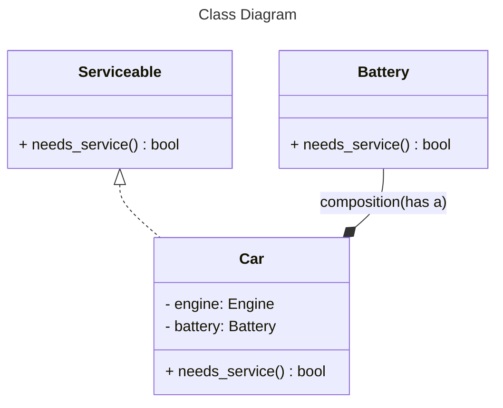

## The Class Diagram

```mermaid
---
title: Class Diagram
---

classDiagram
    class Serviceable {
      + needs_service() bool
    }
    Serviceable <|.. Car

    class Car {
      - engine: Engine
      - battery: Battery 
      + needs_service() bool
    }

    class Battery {
      + needs_service() bool
    }
    Battery --* Car : composition(has a)
    
```